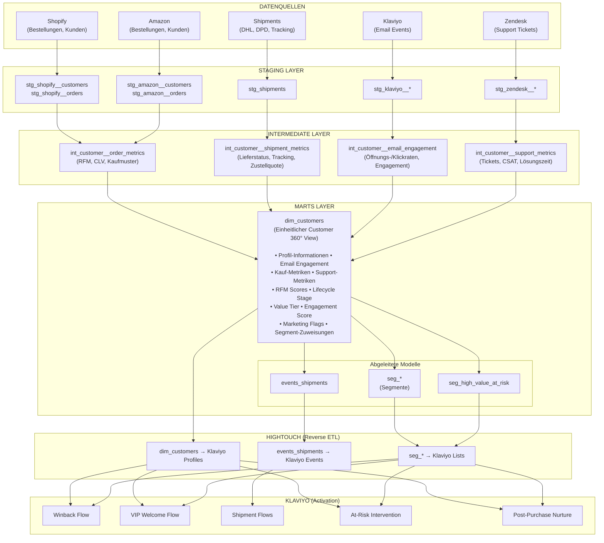

# MLC-direct Customer 360° CDP (Customer Data Platform) Konzept

## Übersicht

Konzept für einen **einheitlichen Customer 360° View** für die MLC-direct D2C E-Commerce-Plattform, inklusive **Reverse ETL** Synchronisation nach **Klaviyo**.

### Was ist Reverse ETL?

**Reverse ETL** ist eine Technologie, die als **Brücke zwischen Data Warehouse (BigQuery) und operativen Tools (z.B. Klaviyo, Salesforce, HubSpot)** fungiert:

- **Ohne Reverse ETL:** Kundendaten liegen isoliert im Data Warehouse und können nicht für Marketing genutzt werden
- **Mit Reverse ETL:** Kundensegmente und -eigenschaften werden automatisch in Marketing-Tools übertragen

Reverse ETL ermöglicht es, datengetriebene Kundenprofile und Segmente, die wir in BigQuery erstellen, direkt für personalisierte E-Mail-Kampagnen zu nutzen – ohne manuelle Exporte oder IT-Aufwand.

**Beispiel-Tools:** Hightouch, Census, Polytomic, Rudderstack

➡️ *Im weiteren Dokument wird Hightouch als Reverse ETL Tool verwendet.*

### Architektur auf einen Blick

```
Shopify  ─────┐
Amazon   ─────┤
Klaviyo  ─────┼──→  BigQuery  ──→  dbt Models  ──→  Hightouch  ──→  Klaviyo
Zendesk  ─────┤      (raw)        (unified)      (reverse ETL)    (activation)
Shipments ────┘
```

### Detaillierte Architektur



### Erweiterbarkeit

Die Plattform ist **leicht erweiterbar** für neue Vertriebskanäle. Beim Hinzufügen neuer Shops (z.B. Temu, eBay, Otto, Kaufland) müssen lediglich:
1. Die Datenquelle an BigQuery angeschlossen werden (via DLT / Cloud Functions)
2. Entsprechende Staging-Modelle (`stg_[shop]__customers`, `stg_[shop]__orders`) erstellt werden

Die bestehende Logik in den Intermediate- und Marts-Layern übernimmt automatisch die Integration in den Customer 360° View.

## Klaviyo Flows Setup Beispiele

---

### 1. Winback Flow

> **Ziel:** Kunden reaktivieren, die länger nicht gekauft haben

| | |
|---|---|
| **Trigger** | Hinzugefügt zur Liste "Winback Candidates" |
| **Split nach** | `winback_stage` Property |

| Stage | Aktion |
|-------|--------|
| `early_winback` | Sanfte Erinnerung, kein Rabatt |
| `mid_winback` | 10% Rabatt-Angebot |
| `late_winback` | 15-20% Rabatt + Dringlichkeit |

---

### 2. VIP Flow

> **Ziel:** Top-Kunden mit hohem CLV besonders wertschätzen

| | |
|---|---|
| **Trigger** | Hinzugefügt zur Liste "VIP Customers" |
| **Split nach** | `vip_tier` Property |

| Tier | Aktion |
|------|--------|
| `platinum` | Persönliche Ansprache, exklusiver Zugang |
| `gold` | Früher Zugang zu Sales |
| `silver` | Erinnerung an Treueprogramm |

---

### 3. Cross-Channel Flow

> **Ziel:** Kunden belohnen, die über mehrere Kanäle kaufen (z.B. Shopify + Amazon)

| | |
|---|---|
| **Trigger** | Hinzugefügt zur Liste "Cross-Channel Customers" |
| **Split nach** | `channels_count` Property |

| Kanäle | Aktion |
|--------|--------|
| 2 Kanäle | Danke-Mail + kleiner Bonus |
| 3+ Kanäle | Exklusiver Loyalty-Status + besondere Angebote |

---

### 4. Shipment Flows

> **Ziel:** Kunden proaktiv über Versandstatus informieren

#### 4a. Package Shipped Flow

| | |
|---|---|
| **Trigger** | Event "Package Shipped" |

| Timing | Aktion |
|--------|--------|
| Sofort | Tracking-Link + "Dein Paket ist unterwegs" |
| +1 Tag | Cross-Sell: "Während du wartest..." |
| +2 Tage | Anwendungstipps für bestellte Produkte |

#### 4b. Package Delivered Flow

| | |
|---|---|
| **Trigger** | Event "Package Delivered" |

| Timing | Aktion |
|--------|--------|
| +3-5 Tage | Review Request |
| +7 Tage | Anwendungstipps |
| +25 Tage | Replenishment-Reminder starten |

#### 4c. Delivery Problem Flow

| | |
|---|---|
| **Trigger** | Event "Delivery Failed" oder "Delivery Delayed" |

| Problem | Aktion |
|---------|--------|
| Verspätung | Proaktive Entschuldigung |
| Fehlgeschlagen | Support-Kontakt anbieten |

---

### 5. At-Risk Intervention

> **Ziel:** High Value Customers mit ungelösten Zendesk Tickets retten

| | |
|---|---|
| **Trigger** | Hinzugefügt zur Liste "High Value At Risk" |
| **Split nach** | `recommended_action` Property |

| Action | Aktion |
|--------|--------|
| `resolve_support_first` | Verzögerung, prüfen ob Ticket gelöst |
| `service_recovery` | Entschuldigung + Kompensationsangebot |
| `incentive_offer` | Rückgewinnungs-Rabatt |

---

### 6. Product Recommendation Flow

> **Ziel:** Cross-Sell/Upsell basierend auf Kaufhistorie

| | |
|---|---|
| **Trigger** | Hinzugefügt zur Liste "Upsell Candidates" |
| **Split nach** | `preferred_categories` Property |

**Beispiele für tetesept, goodvita, rund.um:**

| Gekauft | Empfehlung |
|---------|------------|
| Energie-Produkte | Konzentrations-Produkte (Focus Plus Sticks) |
| Schlaf-Produkte | Ruhe/Calm-Produkte (Reishi Kapseln) |
| Immun-Produkte | Komplett-Bundles |
| Einzelprodukte | Bundle-Builder mit Rabatt |
| Kapseln | Passende Plus Sticks (Booster) |
| tetesept | Premium-Linie (rund.um, goodvita) |

---

### 7. Replenishment Flow

> **Ziel:** Automatischer Nachkauf-Reminder nach 30 Tagen

| | |
|---|---|
| **Trigger** | Event "Package Delivered" + 25 Tage Wartezeit |
| **Split nach** | `product_type` Property |

| Produkttyp | Aktion |
|------------|--------|
| Verbrauchsprodukte | "Zeit für Nachschub?" + Direktlink |
| Einmalprodukte | Nur Nachfüllsalz empfehlen |
| Nach 2. Reminder | Kleiner Anreiz (5-10% Rabatt) |

---

### 8. Saisonale Flows

> **Ziel:** Proaktive Ansprache basierend auf Jahreszeit

#### 8a. Erkältungssaison (September - Februar)

| | |
|---|---|
| **Trigger** | Segment "Erkältungsprodukt-Käufer" + Datum |
| **Produkte** | tetesept Nasendusche, Immunprodukte, zirkulin Propolis |
| **Message** | "Der Herbst kommt – bist du vorbereitet?" |

#### 8b. Allergiesaison (März - Juni)

| | |
|---|---|
| **Trigger** | Segment "Allergie-Käufer" + Datum |
| **Produkte** | tetesept Nasendusche bei Pollenallergie |
| **Message** | "Pollenzeit startet – jetzt vorsorgen" |

#### 8c. Adventskalender (Oktober - November)

| | |
|---|---|
| **Trigger** | Alle Kunden oder VIPs + Datum |
| **Aktion** | Früher Zugang für VIPs, Reminder-Serie |
| **Message** | "Sichere dir deinen Adventskalender!" |

---

### 9. Schwangerschafts-Journey Flow

> **Ziel:** Langfristige Begleitung über 9+ Monate
>
> ⚠️ **Wichtig:** Opt-in für diese Journey (sensibles Thema)

| | |
|---|---|
| **Trigger** | Kauf von Schwangerschaftsvitaminen |

| Zeitraum | Content |
|----------|---------|
| Monat 1-3 | Folsäure, Übelkeit-Tipps |
| Monat 4-6 | Eisen, Energie |
| Monat 7-9 | Geburtsvorbereitung |
| Nach Geburt | Stillzeit-Vitamine, Baby-Pflege Cross-Sell |

---

### 10. Neukunden-Willkommens-Flow

> **Ziel:** Erste Beziehung aufbauen (größte Herausforderung!)

| | |
|---|---|
| **Trigger** | Erster Kauf abgeschlossen |

| Tag | Aktion |
|-----|--------|
| 1 | Danke + Versandinfo |
| 3 | Markengeschichte (tetesept/zirkulin/SOS) |
| 7 | Anwendungstipps für gekauftes Produkt |
| 14 | Bewertung anfragen |
| 21 | Cross-Sell basierend auf Erstkauf |
| 30 | Replenishment-Reminder |

---

### 11. Schlaf-Routine Flow

> **Ziel:** Kunden mit Schlafprodukten langfristig begleiten

| | |
|---|---|
| **Trigger** | Kauf von Schlaf-/Einschlafprodukten |

| Timing | Content |
|--------|---------|
| +3 Tage | Tipps für besseren Schlaf (Content Marketing) |
| +14 Tage | Ergänzende Produkte (zirkulin Baldrian, Melatonin) |
| +30 Tage | "Wie schläfst du jetzt?" + Feedback |

## Wichtige Metriken im dim_customers

| Metrik | Beschreibung | Verwendung |
|--------|--------------|------------|
| `lifecycle_stage` | prospect → new → active → at_risk → lapsing → churned | Segmentierung |
| `customer_value_tier` | vip / high / medium / low / no_purchase | Priorisierung |
| `engagement_score` | 0-100 Score aus Kauf + Email + Support | Health Metric |
| `rfm_segment` | 3-stelliger RFM Code (z.B. "555" = Beste) | Targeting |
| `is_winback_candidate` | Boolean Flag | Trigger für Flows |
| `is_high_value_at_risk` | Boolean Flag | Prioritäts-Alarm |
| `preferred_categories` | Meist gekaufte Produktkategorien | Cross-Sell Targeting |
| `avg_order_value` | Durchschnittlicher Bestellwert | Upsell-Potenzial |
| `cross_sell_score` | 0-100 Score für Cross-Sell Wahrscheinlichkeit | Priorisierung |
| `avg_delivery_time` | Durchschnittliche Lieferzeit | Service-Qualität |
| `delivery_success_rate` | Zustellquote | Risiko-Indikator |

## Voraussetzungen

### Datenquellen in BigQuery
- ✅ Shopify-Daten (bereits über bestehende Pipeline synchronisiert)
- ✅ Amazon-Daten (bereits über bestehende Pipeline synchronisiert)
- ✅ Shipment-Daten (bereits in BigQuery - DHL, DPD, etc.)
- ⏳ Klaviyo-Daten (ausstehend - über Klaviyos nativem BigQuery Export)
- ⏳ Zendesk-Daten (ausstehend - über DLT <1 Tag Setup)

## Kostenvergleich

| Lösung | Monatliche Kosten | Jährliche Kosten |
|--------|-------------------|------------------|
| **Diese Lösung** | | |
| dbt (Open Source, Self-Hosted) | ~€20 | ~€240 |
| BigQuery (Scanning + Storage) | ~€20 | ~€240 |
| Hightouch (Free Tier: 2 Syncs) | €0 | €0 |
| Klaviyo (besteht bereits) | €0 | €0 |
| **Gesamt** | **~€40/Monat** | **~€480/Jahr** |
| | | |
| **Salesforce Alternative** | | |
| Sales Cloud | | ~€20.000+ |
| Data Cloud | | ~€60.000+ |
| Marketing Cloud | | ~€15.000+ |
| Implementierung | | ~€50.000+ |
| **Gesamt** | | **€145.000+/Jahr** |

### Hightouch Free Tier Details
- **2 aktive Syncs** pro Monat (reicht für: 1x dim_customers → Klaviyo Profiles + 1x Segment-Sync)
- Stündliche Sync-Frequenz (maximal)
- Unbegrenzte Destinations und User Seats
- 100 Mio. Operations/Monat
- Für mehr Syncs: Self-Serve Plan (Preis auf Anfrage) oder Segmente direkt in Klaviyo aus den synchronisierten Properties erstellen

### Implementierungsvergleich

| | Diese Lösung | Salesforce |
|--|--------------|------------|
| **Externe Hilfe nötig** | Nein | Ja (Implementierungspartner) |
| **Vorhandene Expertise** | Ja (BigQuery, dbt, Klaviyo bereits im Einsatz) | Nein |
| **Beratungsaufwand** | Minimal | Hoch (Discovery, Workshops, Change Management) |
| **Time-to-Value** | Wochen | Monate |
| **Risiko** | Gering (inkrementell erweiterbar) | Hoch (Big-Bang Migration) |

**Fazit:** Beide Lösungen erfordern Implementierung, aber diese Lösung nutzt bereits vorhandene Tools und internes Know-how. Salesforce würde externe Berater, längere Projektlaufzeiten und erheblichen Abstimmungsaufwand erfordern.

**Hauptaufwand:** Der größte Implementierungsaufwand liegt im Erstellen der dbt-Modelle. Dies ist jedoch ein perfekter Use Case für **Claude Code** (KI-gestützte Entwicklung), wodurch wir deutlich schneller sind als bei klassischer Entwicklung.

## Nächste Schritte

1. [ ] Quellen in BigQuery verifizieren (Schema-Namen anpassen)
2. [ ] dbt-Modelle deployen & testen
3. [ ] Hightouch Free Tier aktivieren
4. [ ] Ersten Sync (dim_customers) konfigurieren
5. [ ] In Klaviyo: Flow für erstes Segment erstellen

---

# Anhang: Technische Details

## Modell-Struktur

```
models/
├── staging/
│   ├── stg_shopify__customers.sql
│   ├── stg_shopify__orders.sql
│   ├── stg_amazon__customers.sql
│   ├── stg_amazon__orders.sql
│   ├── stg_shipments.sql
│   ├── stg_klaviyo__profiles.sql
│   ├── stg_klaviyo__events.sql
│   ├── stg_zendesk__tickets.sql
│   └── stg_zendesk__users.sql
├── intermediate/
│   ├── int_customer__order_metrics.sql
│   ├── int_customer__shipment_metrics.sql
│   ├── int_customer__email_engagement.sql
│   └── int_customer__support_metrics.sql
├── marts/
│   ├── dim_customers.sql              # ← Haupt-Modell für Klaviyo Profiles
│   ├── events_shipments.sql           # ← Für Klaviyo Events (Shipped/Delivered)
│   └── segments/
│       ├── seg_winback_candidates.sql
│       ├── seg_vip_customers.sql
│       ├── seg_repeat_purchase_candidates.sql
│       └── seg_high_value_at_risk.sql
└── schema.yml
```

## Hightouch Setup

### 1. Quelle: BigQuery verbinden

```
Project ID: merz-logistic-merge-poc
Dataset: dbt_prod_klavyio (dedizierter Mart für Klaviyo Marts)
Service Account: bigquery-mlcflow@merz-logistic-merge-poc.iam.gserviceaccount.com
```

### 2. Modelle auswählen

Hightouch kann direkt dbt-Modelle referenzieren:
- Aktiviere "dbt Core" Integration
- Verbinde das [Git Repo](https://github.com/MLC-Digital-Transformation/dbt)
- Modelle mit Tag `klaviyo_sync` werden automatisch erkannt

### 3. Syncs konfigurieren

#### Sync 1: Customer Profiles (dim_customers → Klaviyo Profiles)

| BigQuery-Spalte | Klaviyo-Feld | Typ |
|-----------------|--------------|-----|
| email | Email | Identifier |
| first_name | First Name | Property |
| last_name | Last Name | Property |
| lifetime_revenue | LTV | Property |
| total_orders | Total Orders | Property |
| lifecycle_stage | Lifecycle Stage | Property |
| customer_value_tier | Value Tier | Property |
| engagement_score | Engagement Score | Property |
| rfm_segment | RFM Segment | Property |
| is_vip | Is VIP | Property |
| days_since_last_order | Days Since Last Order | Property |
| ... | ... | ... |

**Zeitplan:** z.B. Alle 6 Stunden oder wenn die Marts refreshed werden.

#### Sync 2: Shipment Events (events_shipments → Klaviyo Events)

| BigQuery-Spalte | Klaviyo-Feld | Typ |
|-----------------|--------------|-----|
| email | Email | Identifier |
| event_name | Event Name | Event (Package Shipped / Package Delivered) |
| tracking_url | Tracking URL | Property |
| carrier | Carrier | Property |
| order_id | Order ID | Property |
| event_timestamp | Timestamp | Property |

**Zeitplan:** Stündlich (oder häufiger bei Bedarf)

#### Sync 3-6: Segmente (seg_* → Klaviyo Lists)

Für jede Segment-Tabelle:
1. Neuen Sync erstellen
2. Modell: z.B. `seg_winback_candidates`
3. Ziel: Klaviyo List
4. Modus: **Mirror** (Profile werden automatisch hinzugefügt/entfernt)
5. Abgleich über: Email

**Zeitplan:** Täglich oder alle 12 Stunden
