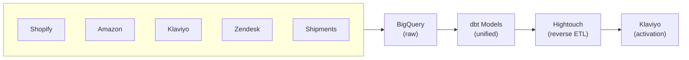

# MLC-direct Customer 360° CDP (Customer Data Platform) Konzept

## Übersicht

Konzept für einen **einheitlichen Customer 360° View** für die MLC-direct D2C E-Commerce-Plattform, inklusive **Reverse ETL** Synchronisation nach **Klaviyo**.

### Was ist Reverse ETL?

**Reverse ETL** ist eine Technologie, die als **Brücke zwischen Data Warehouse (BigQuery) und operativen Tools (z.B. Klaviyo, Salesforce, HubSpot)** fungiert:

- **Ohne Reverse ETL:** Kundendaten liegen isoliert im Data Warehouse und können nicht für Marketing genutzt werden
- **Mit Reverse ETL:** Kundensegmente und -eigenschaften werden automatisch in Marketing-Tools übertragen

Reverse ETL ermöglicht es, datengetriebene Kundenprofile und Segmente, die wir in BigQuery erstellen, direkt für personalisierte E-Mail-Kampagnen zu nutzen – ohne manuelle Exporte oder IT-Aufwand.

**Beispiel-Tools:** Hightouch, Census, Polytomic, Rudderstack

➡️ *Im weiteren Dokument wird Hightouch als Reverse ETL Tool verwendet.*

### Architektur auf einen Blick



### Detaillierte Architektur

```mermaid
flowchart TB
    subgraph sources["DATENQUELLEN"]
        shopify["Shopify<br/>(Bestellungen, Kunden)"]
        amazon["Amazon<br/>(Bestellungen, Kunden)"]
        shipments["Shipments<br/>(DHL, DPD, Tracking)"]
        klaviyo_in["Klaviyo<br/>(Events, Subscriptions, Profildaten)"]
        zendesk["Zendesk<br/>(Support Tickets)"]
    end

    subgraph staging["STAGING LAYER"]
        stg_shopify["stg_shopify__customers<br/>stg_shopify__orders"]
        stg_amazon["stg_amazon__customers<br/>stg_amazon__orders"]
        stg_ship["stg_shipments"]
        stg_klaviyo["stg_klaviyo__*"]
        stg_zendesk["stg_zendesk__*"]
    end

    subgraph intermediate["INTERMEDIATE LAYER"]
        int_order["int_customer__order_metrics<br/>(RFM, CLV, Kaufmuster)"]
        int_ship["int_customer__shipment_metrics<br/>(Lieferstatus, Tracking, Zustellquote)"]
        int_email["int_customer__email_engagement<br/>(Öffnungs-/Klickraten, Engagement,<br/>Subscriptions, Demografie)"]
        int_support["int_customer__support_metrics<br/>(Tickets, CSAT, Lösungszeit)"]
    end

    subgraph marts["MARTS LAYER"]
        dim_customers["dim_customers<br/>(Einheitlicher Customer 360° View)<br/><br/>• Profil &amp; Demografie • Email Engagement<br/>• Kauf-Metriken • Support-Metriken<br/>• RFM Scores • Lifecycle Stage<br/>• Value Tier • Engagement Score<br/>• Marketing Flags • Segment-Zuweisungen"]

        subgraph marts_outputs["Abgeleitete Modelle"]
            seg["seg_*<br/>(Segmente)"]
            events["events_shipments"]
            seg_risk["seg_high_value_at_risk"]
        end
    end

    subgraph hightouch["HIGHTOUCH (Reverse ETL)"]
        sync1["dim_customers → Klaviyo Profiles"]
        sync2["seg_* → Klaviyo Lists"]
        sync3["events_shipments → Klaviyo Events"]
    end

    subgraph klaviyo_out["KLAVIYO (Activation)"]
        flow1["Winback Flow"]
        flow2["VIP Welcome Flow"]
        flow3["Shipment Flows"]
        flow4["At-Risk Intervention"]
        flow5["Post-Purchase Nurture"]
    end

    %% Connections: Sources to Staging
    shopify --> stg_shopify
    amazon --> stg_amazon
    shipments --> stg_ship
    klaviyo_in --> stg_klaviyo
    zendesk --> stg_zendesk

    %% Connections: Staging to Intermediate
    stg_shopify --> int_order
    stg_amazon --> int_order
    stg_ship --> int_ship
    stg_klaviyo --> int_email
    stg_zendesk --> int_support

    %% Connections: Intermediate to Marts
    int_order --> dim_customers
    int_ship --> dim_customers
    int_email --> dim_customers
    int_support --> dim_customers

    %% Connections: dim_customers to outputs
    dim_customers --> seg
    dim_customers --> events
    dim_customers --> seg_risk

    %% Connections: Marts to Hightouch
    dim_customers --> sync1
    seg --> sync2
    seg_risk --> sync2
    events --> sync3

    %% Connections: Hightouch to Klaviyo
    sync1 --> flow1
    sync1 --> flow2
    sync1 --> flow4
    sync1 --> flow5
    sync2 --> flow1
    sync2 --> flow2
    sync2 --> flow4
    sync2 --> flow5
    sync3 --> flow3
```



### Erweiterbarkeit

Die Plattform ist **leicht erweiterbar** für neue Vertriebskanäle. Beim Hinzufügen neuer Shops (z.B. Temu, eBay, Otto, Kaufland) müssen lediglich:
1. Die Datenquelle an BigQuery angeschlossen werden (via DLT / Cloud Functions)
2. Entsprechende Staging-Modelle (`stg_[shop]__customers`, `stg_[shop]__orders`) erstellt werden

Die bestehende Logik in den Intermediate- und Marts-Layern übernimmt automatisch die Integration in den Customer 360° View.

## Klaviyo Flows Setup Beispiele

---

### 1. Neukunden-Willkommens-Flow

> **Ziel:** Erste Beziehung aufbauen (größte Herausforderung!)

| | |
|---|---|
| **Trigger** | Erster Kauf abgeschlossen |

```mermaid
flowchart TD
    trigger(["🛒 Erster Kauf abgeschlossen"]) --> day1

    subgraph day1["Tag 1"]
        email1["📧 Danke + Versandinfo"]
    end

    day1 --> wait3["⏳ 2 Tage warten"]
    wait3 --> day3

    subgraph day3["Tag 3"]
        email2["📧 Markengeschichte<br/>(tetesept/zirkulin/SOS)"]
    end

    day3 --> check_click{{"Klick auf Email?"}}

    check_click -->|Ja| engaged_path
    check_click -->|Nein| standard_path

    subgraph engaged_path["Engagierter Pfad"]
        day5_eng["📧 Tag 5: Exklusiver Content<br/>(Gesundheitstipps)"]
        day5_eng --> day7_eng["📧 Tag 7: Personalisierte<br/>Produktempfehlungen"]
    end

    subgraph standard_path["Standard Pfad"]
        day7_std["📧 Tag 7: Anwendungstipps<br/>für gekauftes Produkt"]
    end

    engaged_path --> check_purchase{{"Neukauf getätigt?"}}
    standard_path --> check_purchase

    check_purchase -->|Ja| buyer_path
    check_purchase -->|Nein| nurture_path

    subgraph buyer_path["Käufer-Pfad"]
        thank_you["📧 Danke für 2. Kauf!<br/>+ VIP-Teaser"]
        thank_you --> loyal["➡️ Weiter zu<br/>Loyalty-Flow"]
    end

    subgraph nurture_path["Nurture-Pfad"]
        day14["📧 Tag 14: Bewertung anfragen"]
        day14 --> check_review{{"Bewertung<br/>abgegeben?"}}

        check_review -->|Ja| day21_reward["📧 Tag 21: Danke +<br/>10% Gutschein"]
        check_review -->|Nein| day21_crosssell["📧 Tag 21: Cross-Sell<br/>basierend auf Erstkauf"]

        day21_reward --> day30
        day21_crosssell --> day30

        day30["📧 Tag 30: Replenishment-<br/>Reminder"]
    end

    day30 --> check_final{{"Kauf innerhalb<br/>30 Tage?"}}
    check_final -->|Ja| active(["✅ Status: Active Customer"])
    check_final -->|Nein| winback(["⚠️ Weiter zu Winback-Flow"])
```



**Legende:**
| Symbol | Bedeutung |
|--------|-----------|
| 📧 | Email-Versand |
| ⏳ | Wartezeit |
| 🛒 | Kauf-Event |
| ◇ | Bedingte Verzweigung (basierend auf Kundenverhalten) |

---

### 2. Winback Flow

> **Ziel:** Kunden reaktivieren, die länger nicht gekauft haben

| | |
|---|---|
| **Trigger** | Hinzugefügt zur Liste "Winback Candidates" |
| **Split nach** | `winback_stage` Property |

```mermaid
flowchart TD
    trigger(["⚠️ Kunde auf Winback-Liste<br/>(60+ Tage ohne Kauf)"]) --> check_stage{{"winback_stage?"}}

    check_stage -->|early_winback<br/>60-90 Tage| early
    check_stage -->|mid_winback<br/>90-120 Tage| mid
    check_stage -->|late_winback<br/>120+ Tage| late

    subgraph early["🟢 Early Winback"]
        early_email1["📧 Email 1: Wir vermissen dich!<br/>(kein Rabatt)"]
        early_email1 --> early_wait["⏳ 5 Tage warten"]
        early_wait --> early_check{{"Gekauft?"}}
        early_check -->|Nein| early_email2["📧 Email 2: Neue Produkte<br/>die dir gefallen könnten"]
    end

    subgraph mid["🟡 Mid Winback"]
        mid_email1["📧 Email 1: 10% Rabatt<br/>WINBACK10"]
        mid_email1 --> mid_wait["⏳ 5 Tage warten"]
        mid_wait --> mid_check{{"Gekauft?"}}
        mid_check -->|Nein| mid_email2["📧 Email 2: Reminder<br/>Code läuft bald ab!"]
    end

    subgraph late["🔴 Late Winback"]
        late_email1["📧 Email 1: 20% Rabatt<br/>COMEBACK20"]
        late_email1 --> late_wait["⏳ 7 Tage warten"]
        late_wait --> late_check{{"Gekauft?"}}
        late_check -->|Nein| late_email2["📧 Email 2: Letzte Chance!<br/>+ Kostenloser Versand"]
        late_email2 --> late_wait2["⏳ 7 Tage warten"]
        late_wait2 --> late_check2{{"Gekauft?"}}
    end

    early_check -->|Ja| reactivated
    early_email2 --> early_final["⏳ 7 Tage warten"] --> early_final_check{{"Gekauft?"}}
    early_final_check -->|Ja| reactivated
    early_final_check -->|Nein| escalate_mid["⬆️ Eskalation zu<br/>Mid Winback"]
    escalate_mid --> mid

    mid_check -->|Ja| reactivated
    mid_email2 --> mid_final["⏳ 7 Tage warten"] --> mid_final_check{{"Gekauft?"}}
    mid_final_check -->|Ja| reactivated
    mid_final_check -->|Nein| escalate_late["⬆️ Eskalation zu<br/>Late Winback"]
    escalate_late --> late

    late_check -->|Ja| reactivated
    late_check2 -->|Ja| reactivated
    late_check2 -->|Nein| churned

    reactivated(["✅ Reaktiviert!<br/>→ Update lifecycle_stage"])
    churned(["❌ Churned<br/>→ Suppress für 90 Tage"])

    churned --> final_attempt["⏳ 90 Tage Pause"]
    final_attempt --> last_chance["📧 Finale Email:<br/>Goodbye + 25% Rabatt"]
    last_chance --> last_check{{"Gekauft?"}}
    last_check -->|Ja| reactivated
    last_check -->|Nein| archived(["📁 Archiviert<br/>Keine weiteren Emails"])
```



**Eskalationslogik:**
| Stage | Tage ohne Kauf | Rabatt | Max. Emails |
|-------|----------------|--------|-------------|
| Early | 60-90 | 0% | 2 |
| Mid | 90-120 | 10% | 2 |
| Late | 120+ | 20% | 2 |
| Final | 210+ | 25% | 1 (letzte Chance) |

---

### 3. VIP Flow

> **Ziel:** Top-Kunden mit hohem CLV besonders wertschätzen

| | |
|---|---|
| **Trigger** | Hinzugefügt zur Liste "VIP Customers" |
| **Split nach** | `vip_tier` Property |

| Tier | Aktion |
|------|--------|
| `platinum` | Persönliche Ansprache, exklusiver Zugang |
| `gold` | Früher Zugang zu Sales |
| `silver` | Erinnerung an Treueprogramm |

---

### 4. Cross-Channel Flow

> **Ziel:** Kunden belohnen, die über mehrere Kanäle kaufen (z.B. Shopify + Amazon)

| | |
|---|---|
| **Trigger** | Hinzugefügt zur Liste "Cross-Channel Customers" |
| **Split nach** | `channels_count` Property |

| Kanäle | Aktion |
|--------|--------|
| 2 Kanäle | Danke-Mail + kleiner Bonus |
| 3+ Kanäle | Exklusiver Loyalty-Status + besondere Angebote |

---

### 5. Shipment Flows

> **Ziel:** Kunden proaktiv über Versandstatus informieren

#### 5a. Package Shipped Flow

| | |
|---|---|
| **Trigger** | Event "Package Shipped" |

| Timing | Aktion |
|--------|--------|
| Sofort | Tracking-Link + "Dein Paket ist unterwegs" |
| +1 Tag | Cross-Sell: "Während du wartest..." |
| +2 Tage | Anwendungstipps für bestellte Produkte |

#### 5b. Package Delivered Flow

| | |
|---|---|
| **Trigger** | Event "Package Delivered" |

| Timing | Aktion |
|--------|--------|
| +3-5 Tage | Review Request |
| +7 Tage | Anwendungstipps |
| +25 Tage | Replenishment-Reminder starten |

#### 5c. Delivery Problem Flow

| | |
|---|---|
| **Trigger** | Event "Delivery Failed" oder "Delivery Delayed" |

| Problem | Aktion |
|---------|--------|
| Verspätung | Proaktive Entschuldigung |
| Fehlgeschlagen | Support-Kontakt anbieten |

---

### 6. At-Risk Intervention

> **Ziel:** High Value Customers mit ungelösten Zendesk Tickets retten

| | |
|---|---|
| **Trigger** | Hinzugefügt zur Liste "High Value At Risk" |
| **Split nach** | `recommended_action` Property |

| Action | Aktion |
|--------|--------|
| `resolve_support_first` | Verzögerung, prüfen ob Ticket gelöst |
| `service_recovery` | Entschuldigung + Kompensationsangebot |
| `incentive_offer` | Rückgewinnungs-Rabatt |

---

### 7. Product Recommendation Flow

> **Ziel:** Cross-Sell/Upsell basierend auf Kaufhistorie

| | |
|---|---|
| **Trigger** | Hinzugefügt zur Liste "Upsell Candidates" |
| **Split nach** | `preferred_categories` Property |

**Beispiele für tetesept, goodvita, rund.um:**

| Gekauft | Empfehlung |
|---------|------------|
| Energie-Produkte | Konzentrations-Produkte (Focus Plus Sticks) |
| Schlaf-Produkte | Ruhe/Calm-Produkte (Reishi Kapseln) |
| Immun-Produkte | Komplett-Bundles |
| Einzelprodukte | Bundle-Builder mit Rabatt |
| Kapseln | Passende Plus Sticks (Booster) |
| tetesept | Premium-Linie (rund.um, goodvita) |

---

### 8. Replenishment Flow

> **Ziel:** Automatischer Nachkauf-Reminder nach 30 Tagen

| | |
|---|---|
| **Trigger** | Event "Package Delivered" + 25 Tage Wartezeit |
| **Split nach** | `product_type` Property |

| Produkttyp | Aktion |
|------------|--------|
| Verbrauchsprodukte | "Zeit für Nachschub?" + Direktlink |
| Einmalprodukte | Nur Nachfüllsalz empfehlen |
| Nach 2. Reminder | Kleiner Anreiz (5-10% Rabatt) |

---

### 9. Saisonale Flows

> **Ziel:** Proaktive Ansprache basierend auf Jahreszeit

#### 9a. Erkältungssaison (September - Februar)

| | |
|---|---|
| **Trigger** | Segment "Erkältungsprodukt-Käufer" + Datum |
| **Produkte** | tetesept Nasendusche, Immunprodukte, zirkulin Propolis |
| **Message** | "Der Herbst kommt – bist du vorbereitet?" |

#### 9b. Allergiesaison (März - Juni)

| | |
|---|---|
| **Trigger** | Segment "Allergie-Käufer" + Datum |
| **Produkte** | tetesept Nasendusche bei Pollenallergie |
| **Message** | "Pollenzeit startet – jetzt vorsorgen" |

#### 9c. Adventskalender (Oktober - November)

| | |
|---|---|
| **Trigger** | Alle Kunden oder VIPs + Datum |
| **Aktion** | Früher Zugang für VIPs, Reminder-Serie |
| **Message** | "Sichere dir deinen Adventskalender!" |

---

### 10. Schwangerschafts-Journey Flow

> **Ziel:** Langfristige Begleitung über 9+ Monate
>
> ⚠️ **Wichtig:** Opt-in für diese Journey (sensibles Thema)

| | |
|---|---|
| **Trigger** | Kauf von Schwangerschaftsvitaminen |

| Zeitraum | Content |
|----------|---------|
| Monat 1-3 | Folsäure, Übelkeit-Tipps |
| Monat 4-6 | Eisen, Energie |
| Monat 7-9 | Geburtsvorbereitung |
| Nach Geburt | Stillzeit-Vitamine, Baby-Pflege Cross-Sell |

---

### 11. Schlaf-Routine Flow

> **Ziel:** Kunden mit Schlafprodukten langfristig begleiten

| | |
|---|---|
| **Trigger** | Kauf von Schlaf-/Einschlafprodukten |

| Timing | Content |
|--------|---------|
| +3 Tage | Tipps für besseren Schlaf (Content Marketing) |
| +14 Tage | Ergänzende Produkte (zirkulin Baldrian, Melatonin) |
| +30 Tage | "Wie schläfst du jetzt?" + Feedback |

## Wichtige Metriken im dim_customers

| Metrik | Beschreibung | Verwendung |
|--------|--------------|------------|
| `lifecycle_stage` | prospect → new → active → at_risk → lapsing → churned | Segmentierung |
| `customer_value_tier` | vip / high / medium / low / no_purchase | Priorisierung |
| `engagement_score` | 0-100 Score aus Kauf + Email + Support | Health Metric |
| `rfm_segment` | 3-stelliger RFM Code (z.B. "555" = Beste) | Targeting |
| `is_winback_candidate` | Boolean Flag | Trigger für Flows |
| `is_high_value_at_risk` | Boolean Flag | Prioritäts-Alarm |
| `preferred_categories` | Meist gekaufte Produktkategorien | Cross-Sell Targeting |
| `avg_order_value` | Durchschnittlicher Bestellwert | Upsell-Potenzial |
| `cross_sell_score` | 0-100 Score für Cross-Sell Wahrscheinlichkeit | Priorisierung |
| `avg_delivery_time` | Durchschnittliche Lieferzeit | Service-Qualität |
| `delivery_success_rate` | Zustellquote | Risiko-Indikator |
| `gender` | Geschlecht (aus Newsletter-Anmeldung) | Personalisierung |
| `birth_date` / `age` | Geburtsdatum / Alter | Personalisierung, Produktempfehlungen |
| `has_demographic_data` | Boolean ob Demografie vorhanden | Datenqualität |

## Voraussetzungen

### Datenquellen in BigQuery
- ✅ Shopify-Daten (bereits über bestehende Pipeline synchronisiert)
- ✅ Amazon-Daten (bereits über bestehende Pipeline synchronisiert)
- ✅ Shipment-Daten (bereits in BigQuery - DHL, DPD, etc.)
- ⏳ Klaviyo-Daten (ausstehend - über Klaviyos nativem BigQuery Export: Events, List Subscriptions, Profildaten inkl. Demografie)
- ⏳ Zendesk-Daten (ausstehend - über DLT <1 Tag Setup)

## Kostenvergleich

| Lösung | Monatliche Kosten | Jährliche Kosten |
|--------|-------------------|------------------|
| **Diese Lösung** | | |
| dbt (Open Source, Self-Hosted) | ~€20 | ~€240 |
| BigQuery (Scanning + Storage) | ~€20 | ~€240 |
| Hightouch (Free Tier: 2 Syncs) | €0 | €0 |
| Klaviyo (besteht bereits) | €0 | €0 |
| **Gesamt** | **~€40/Monat** | **~€480/Jahr** |
| | | |
| **Salesforce Alternative** | | |
| Sales Cloud | | ~€20.000+ |
| Data Cloud | | ~€60.000+ |
| Marketing Cloud | | ~€15.000+ |
| Implementierung | | ~€50.000+ |
| **Gesamt** | | **€145.000+/Jahr** |

### Hightouch Free Tier Details
- **2 aktive Syncs** pro Monat (reicht für: 1x dim_customers → Klaviyo Profiles + 1x Segment-Sync)
- Stündliche Sync-Frequenz (maximal)
- Unbegrenzte Destinations und User Seats
- 100 Mio. Operations/Monat
- Für mehr Syncs: Self-Serve Plan (Preis auf Anfrage) oder Segmente direkt in Klaviyo aus den synchronisierten Properties erstellen

### Implementierungsvergleich

| | Diese Lösung | Salesforce |
|--|--------------|------------|
| **Externe Hilfe nötig** | Nein | Ja (Implementierungspartner) |
| **Vorhandene Expertise** | Ja (BigQuery, dbt, Klaviyo bereits im Einsatz) | Nein |
| **Beratungsaufwand** | Minimal | Hoch (Discovery, Workshops, Change Management) |
| **Time-to-Value** | Wochen | Monate |
| **Risiko** | Gering (inkrementell erweiterbar) | Hoch (Big-Bang Migration) |

**Fazit:** Beide Lösungen erfordern Implementierung, aber diese Lösung nutzt bereits vorhandene Tools und internes Know-how. Salesforce würde externe Berater, längere Projektlaufzeiten und erheblichen Abstimmungsaufwand erfordern.

**Hauptaufwand:** Der größte Implementierungsaufwand liegt im Erstellen der dbt-Modelle. Dies ist jedoch ein perfekter Use Case für **Claude Code** (KI-gestützte Entwicklung), wodurch wir deutlich schneller sind als bei klassischer Entwicklung.

## Nächste Schritte

1. [ ] Quellen in BigQuery verifizieren (Schema-Namen anpassen)
2. [ ] dbt-Modelle deployen & testen
3. [ ] Hightouch Free Tier aktivieren
4. [ ] Ersten Sync (dim_customers) konfigurieren
5. [ ] In Klaviyo: Flow für erstes Segment erstellen

---

# Anhang: Technische Details

## Modell-Struktur

```
models/
├── staging/
│   ├── stg_shopify__customers.sql
│   ├── stg_shopify__orders.sql
│   ├── stg_amazon__customers.sql
│   ├── stg_amazon__orders.sql
│   ├── stg_shipments.sql
│   ├── stg_klaviyo__profiles.sql
│   ├── stg_klaviyo__events.sql
│   ├── stg_klaviyo__lists.sql
│   ├── stg_klaviyo__list_memberships.sql
│   ├── stg_zendesk__tickets.sql
│   └── stg_zendesk__users.sql
├── intermediate/
│   ├── int_customer__order_metrics.sql
│   ├── int_customer__shipment_metrics.sql
│   ├── int_customer__email_engagement.sql
│   └── int_customer__support_metrics.sql
├── marts/
│   ├── dim_customers.sql              # ← Haupt-Modell für Klaviyo Profiles
│   ├── events_shipments.sql           # ← Für Klaviyo Events (Shipped/Delivered)
│   └── segments/
│       ├── seg_winback_candidates.sql
│       ├── seg_vip_customers.sql
│       ├── seg_repeat_purchase_candidates.sql
│       └── seg_high_value_at_risk.sql
└── schema.yml
```

## Hightouch Setup

### 1. Quelle: BigQuery verbinden

```
Project ID: merz-logistic-merge-poc
Dataset: dbt_prod_klavyio (dedizierter Mart für Klaviyo Marts)
Service Account: bigquery-mlcflow@merz-logistic-merge-poc.iam.gserviceaccount.com
```

### 2. Modelle auswählen

Hightouch kann direkt dbt-Modelle referenzieren:
- Aktiviere "dbt Core" Integration
- Verbinde das [Git Repo](https://github.com/MLC-Digital-Transformation/dbt)
- Modelle mit Tag `klaviyo_sync` werden automatisch erkannt

### 3. Syncs konfigurieren

#### Sync 1: Customer Profiles (dim_customers → Klaviyo Profiles)

| BigQuery-Spalte | Klaviyo-Feld | Typ |
|-----------------|--------------|-----|
| email | Email | Identifier |
| first_name | First Name | Property |
| last_name | Last Name | Property |
| lifetime_revenue | LTV | Property |
| total_orders | Total Orders | Property |
| lifecycle_stage | Lifecycle Stage | Property |
| customer_value_tier | Value Tier | Property |
| engagement_score | Engagement Score | Property |
| rfm_segment | RFM Segment | Property |
| is_vip | Is VIP | Property |
| days_since_last_order | Days Since Last Order | Property |
| ... | ... | ... |

**Zeitplan:** z.B. Alle 6 Stunden oder wenn die Marts refreshed werden.

#### Sync 2: Shipment Events (events_shipments → Klaviyo Events)

| BigQuery-Spalte | Klaviyo-Feld | Typ |
|-----------------|--------------|-----|
| email | Email | Identifier |
| event_name | Event Name | Event (Package Shipped / Package Delivered) |
| tracking_url | Tracking URL | Property |
| carrier | Carrier | Property |
| order_id | Order ID | Property |
| event_timestamp | Timestamp | Property |

**Zeitplan:** Stündlich (oder häufiger bei Bedarf)

#### Sync 3-6: Segmente (seg_* → Klaviyo Lists)

Für jede Segment-Tabelle:
1. Neuen Sync erstellen
2. Modell: z.B. `seg_winback_candidates`
3. Ziel: Klaviyo List
4. Modus: **Mirror** (Profile werden automatisch hinzugefügt/entfernt)
5. Abgleich über: Email

**Zeitplan:** Täglich oder alle 12 Stunden
